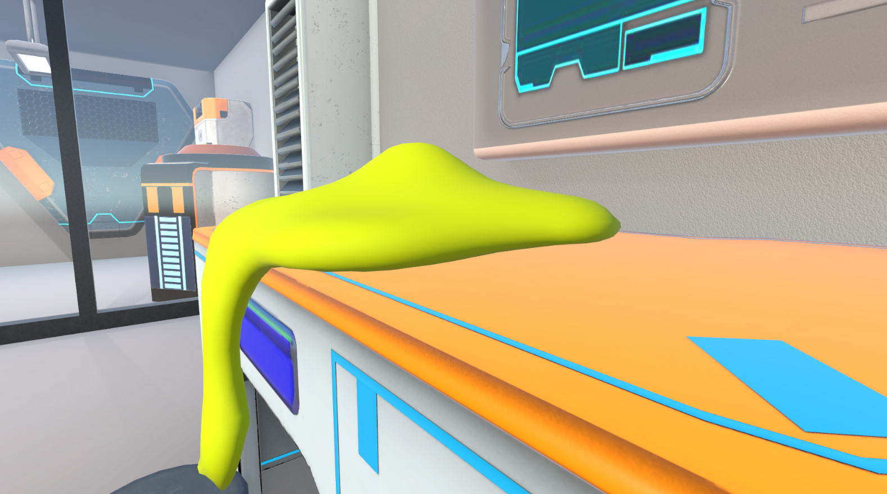
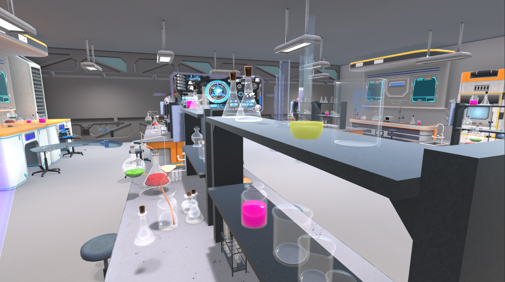
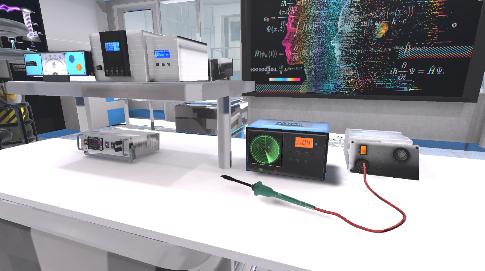

# VR_future_lab_k
“Future Lab” is an innovative Virtual Reality (VR) environment that enables students to conduct science experiments safely, immersively, and without the need for physical laboratory equipment — ideal for schools lacking proper lab infrastructure.

This VR Lab app allows you to do multiple experiments in one place.

## 📸 Screenshots

  
  
  

## 📦 Download APK
👉 **[Download APK (125 MB)](https://drive.google.com/file/d/186lUh8_npiKefU520FVZ03fwVMx-6OeW/view?usp=sharing)**

> Hosted on Google Drive due to GitHub file size limits.

## 🧪 Tested On
- Meta Quest 3 

## 🛠 Installation
1. Download the APK
2. On Meta Quest 3, enable Developer tools ,then **Install unknown apps**
3. Open the APK and install

## ℹ️ Notes
- This repository is for showcasing the project
- Source code not included
